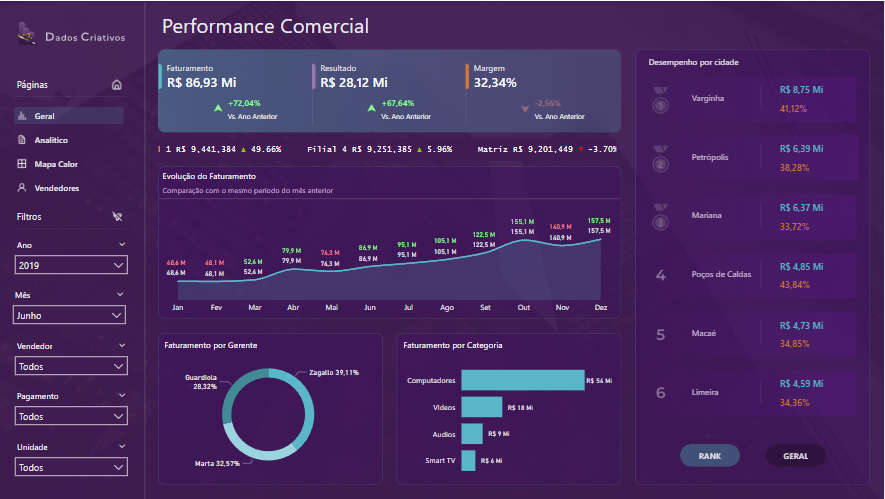
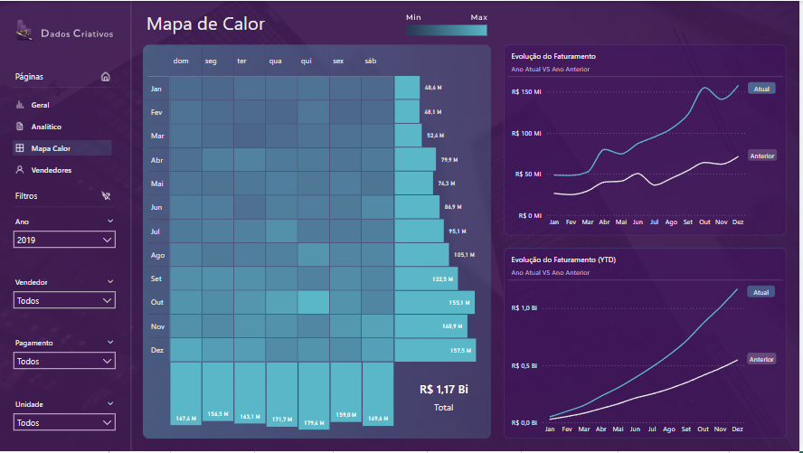
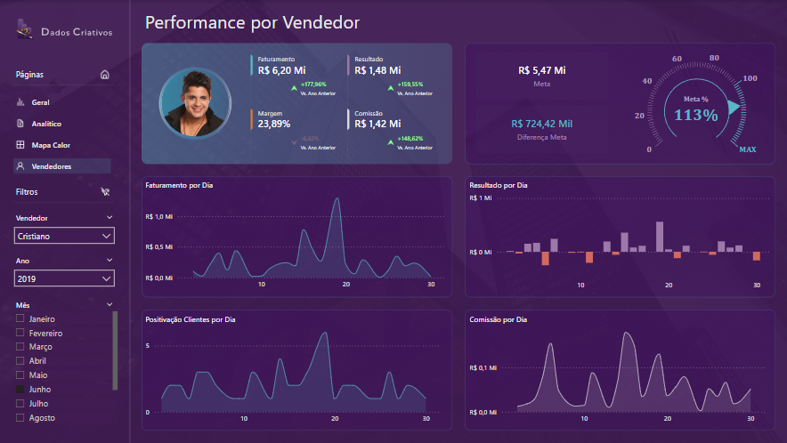

# 📊 Dashboard de Performance Comercial

Dashboard desenvolvido no **Power BI** com foco em **análise estratégica** e **visualização intuitiva de resultados** da área comercial.

---

## 🧠 Objetivo

Fornecer uma visão clara e interativa da performance comercial da empresa, permitindo tomadas de decisão baseadas em dados (data-driven).

---

## 🛠️ Ferramentas Utilizadas

- **Power BI**
- **Figma** (para estrutura e fundo visual personalizado)
- **SQL** (para organização dos dados)
- **Excel/CSV** (base auxiliar)

---

## 📌 Visões no Dashboard

### 🔹 Geral
- Visão consolidada de faturamento, resultado e margem
- Evolução mensal de indicadores
- Análise por gerente e categoria
- Destaque de cidades com melhor performance

---

### 🔹 Mapa de Calor
- Identificação de dias/meses com maior volume de vendas
- Comparativo de faturamento anual

---

### 🔹 Performance por Vendedor
- Acompanhamento detalhado de cada vendedor
- Gráficos diários de faturamento, resultado, comissões e clientes positivados
- Acompanhamento de meta

---

## 📁 Arquivo do Projeto

> O arquivo `.pbix` está neste repositório:
>  
> **`Dashboard Performance Comercial.pbix`**

Você pode abrir e explorar o relatório completo no Power BI Desktop.

---

## ✍️ Autor

**Alexandre Viana**  
Cursando Engenharia de Software • Foco em Power BI & Data Science  
[LinkedIn](https://www.linkedin.com/in/alexandre-viana-a9a02689/)

---

